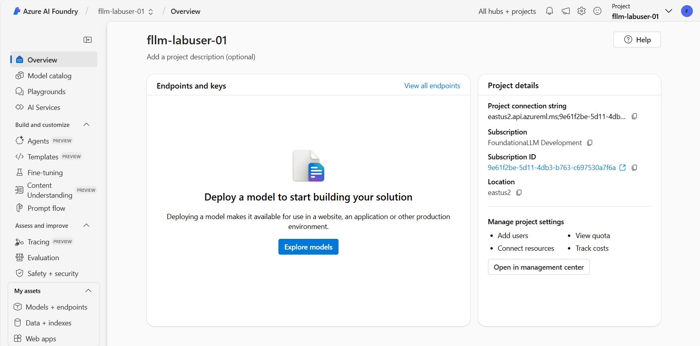
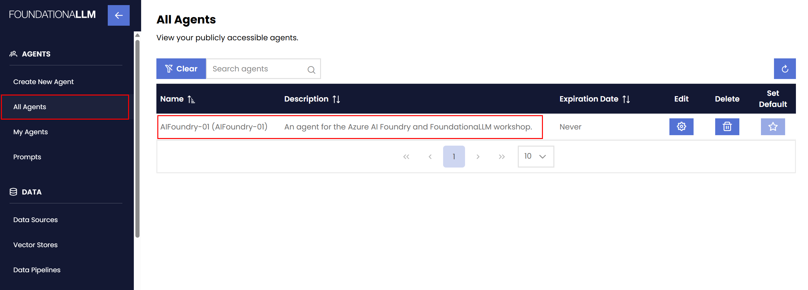
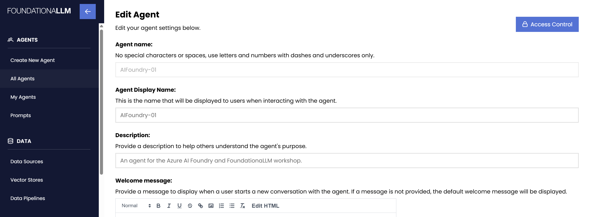
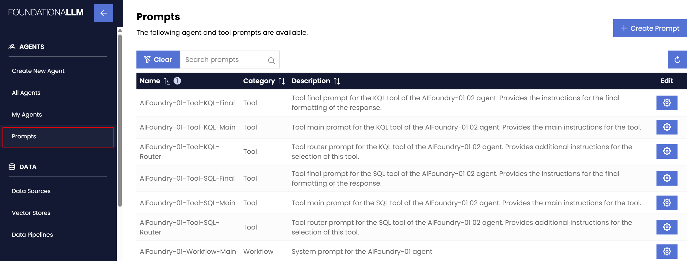
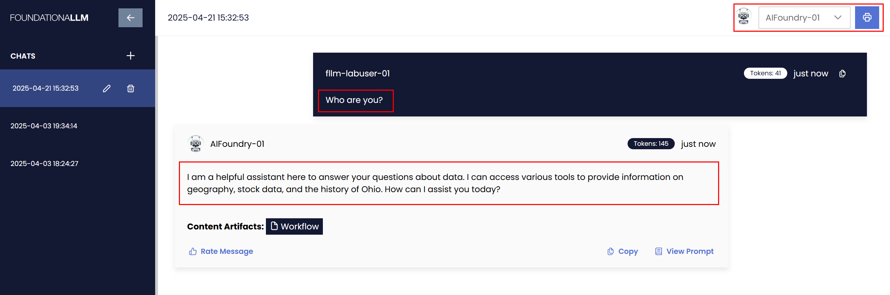
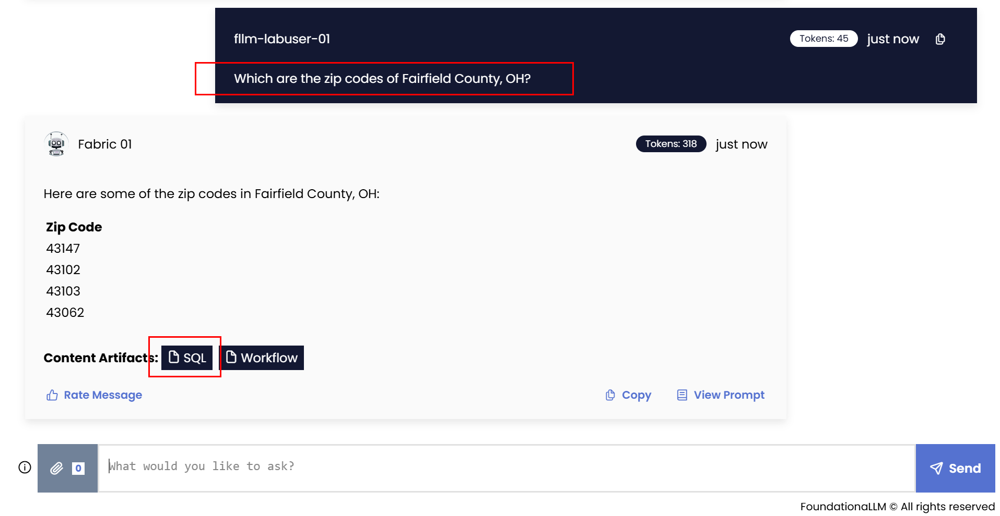
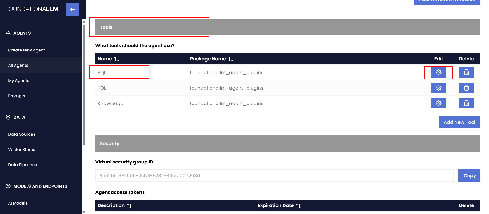
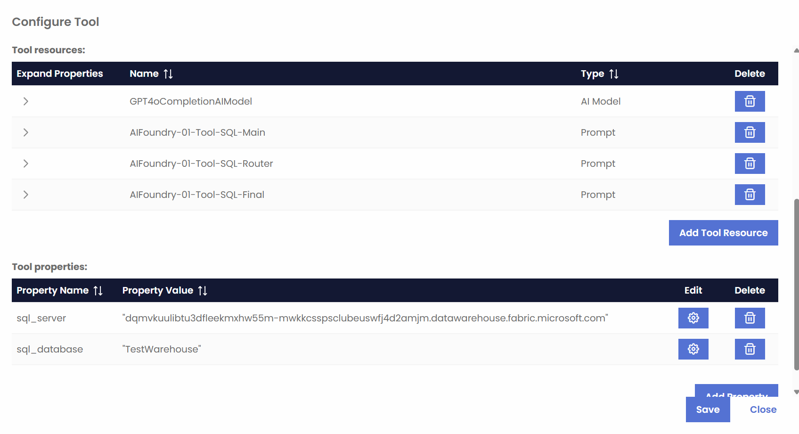

# Build Practical AI Solutions with Azure AI Foundry

This repository contains the materials for the **Build Practical AI Solutions with Azure AI Foundry** Workshop. The workshop is designed to help participants understand how to build practical AI solutions on top of [Azure AI Foundry](https://ai.azure.com/). The use case highlighted in the workshop is [FoundationaLLM](https://foundationallm.ai), a platform for deploying, scaling, securing and governing agents in the enterprise, built on top fo Azure AI Foundry.

## Workshop Agenda

1. **Agent Fundamentals** (presentation)
   - What is an agent?
   - The evolution of agents
   - When to build an agent?
2. **Azure AI Foundry** (presentation)
   - Introduction to Azure AI Foundry
   - Hubs and Projects
   - Azure AI Foundry SDK
   - Models
   - Azure AI Services
3. **Inference API** (presentation)
   - Overview of the Azure AI Model Inference API
4. **FoundationaLLM Overview** (presentation)
   - Agentic solution with FoundationaLLM
   - How we built FoundationaLLM on top of Azure AI Foundry
5. **Lab 1: A practical use of the Azure AI Model Inference API** (lab and demo)
6. **Building Agents** (presentation)
   - Agent creation lifecycle
   - Azure AI Agent Service
   - Azure AI Foundry SDK for Agent Service
7. **Lab 2: Building agents with AI Foundry and FoundationaLLM** (lab and demo)
8. **Building Agents - continued** (presentation)
   - Motivations for RAG
   - RAG as a tool
   - Azure AI Search
   - RAG and fine tuning
9.  **Demo: Knowledge Graphs - the future of RAG** (demo)
10. **Building Agents - continued** (presentation)
    - Code generation and execution as a tool
    - Analytics as a tool
11. **Lab 3: Going beyond the basic tools** (lab and demo)
12. **Building Agents - continued** (presentation)
    - Logic apps as a tool
    - Agents as a tool
13. **Evaluating Agents**
    - Evaluations with Azure AI Foundry
    - Automated evaluation
    - Manual evaluation
    - Custom evaluators
14. **Responsible AI Tools & Practices**
    - Generative AI risks
    - Safguard with Trustworthy AI
    - Mitigation layers in Azure AI Foundry
15. **Use Cases and Open Q&A**


## Labs and Demos

### Lab 1: A practical use of the Azure AI Model Inference API

   - **Objective**: Understand the Azure AI Model Inference API in Azure AI Foundry and how to leverage it in a solution.
   - **Duration**: 25 minutes for the lab and 5 minutes for the demo
   - **Prerequisites**: Access to Azure AI Foundry and FoundationaLLM.

>[!NOTE]
At the end of the lab, the trainer will provide a demo of how is FoundationaLLM using the relevant Azure AI Foundry capabilities behind the scenes. This will help you improve your understanding of the lab and how to leverage the Azure AI Foundry capabilities in a solution.

### Exercise 1 - A tour of the Azure AI Foundry Portal

In this exercise, you will tour the Azure AI Foundry Portal. You will be using your workshop account to access the portal.

>[!NOTE]
>Your workshop account should be `fllm-labuser-NN@foundationallm.ai` (where `NN` is your lab number assigned at the beginning of the workshop).

1. Login to the [Azure AI Foundry Portal](https://ai.azure.com/) using your workshop account.
   
2. Navigate to the `fllm-lab-user-NN` project that is displayed at the top of the scree.

    

3. Explore the various sections of the portal avilable within the project. Make sure to check **Mode catalog**, **AI Services**, **Agents**, **Templates**, **Tracing**, **Evaluation**, **Safety + security**, and **Models + endpoints**.

    

### Exercise 2 - Using the Azure AI Model Inference API

In this exercise, you will deply a model and interact with it using the Azure AI Model Inference API. You will be using your workshop account to access the portal.

1. Login to the [Azure AI Foundry Portal](https://ai.azure.com/) using your workshop account. Select the **Models + endpoints** section from the left navigation pane and then select the **Deploy base model** option from the **+ Deploy model** dropdown.

    

2. Enter the value `phi` in the search box, select the **Phi-4** model from the list of models, and select the **Confirm** button.

    

3. Select the **Serverless API with Azure AI Content Safety** option and then select the **Deploy** button to deploy the model.

4. View the deployment status of the model in the **Models + endpoints** section. The deployment may take a few minutes to complete. Note the code examples in various languages that demonstrate how to interact with the model using the Azure AI Model Inference API.

    

### Exercise 3 - A tour of the FoundationaLLM Management Portal and User Portal

In this exercise, you will tour the FoundationaLLM Management Portal and User Portal. You will be using your workshop account to access the portals.

>[!NOTE]
>Your workshop account should be `fllm-labuser-NN@foundationallm.ai` (where `NN` is your lab number assigned at the beginning of the workshop).

1. Login to the [FoundationaLLM Management Portal](https://camanagementuil43jljq2i5ox6.lemondesert-a0804c39.eastus2.azurecontainerapps.io/) using your workshop account.
2. Navigate to the `All Agents` section and locate the `AIFoundry-NN` agent.

    

3. Select the `Edit` action associated with the agent and observe the properties of the agent. Make sure you scroll all the way down to see all the properties.

     

4. Navigate to the `Prompts` section and locate the prompts associated with the `AIFoundry-NN` agent.

    

5. Login to the [FoundationaLLM User Portal](https://cachatuil43jljq2i5ox6.lemondesert-a0804c39.eastus2.azurecontainerapps.io/) using your workshop account.
6. In the top-right corner, select the `AIFoundry-NN` agent from the dropdown list. This will allow you to interact with the agent you will be working with during the workshop. Ask the agent `Who are you?` to confirm everything is working correctly. The agent should respond as follows:

   

>[!NOTE]
>For the reminder of this workshop, the **FoundationaLLM Management Portal** will be referred to as **Management Portal** and the **FoundationaLLM User Portal** will be referred to as **User Portal**. Also, `NN` will identify the lab number assigned to you at the beginning of the workshop.

### Exercise 4 - Interact with a FoundationaLLM agent using the Inference API
   
1. Login to the [FoundationaLLM User Portal](https://cachatuil43jljq2i5ox6.lemondesert-a0804c39.eastus2.azurecontainerapps.io/) using your workshop account.

2. Submit a question to the `AIFoundry-NN` and note the response.

   TODO: Update screenshot.

3. Login to the [FoundationaLLM Management Portal](https://camanagementuil43jljq2i5ox6.lemondesert-a0804c39.eastus2.azurecontainerapps.io/) using your workshop account. Select the `AIFoundry-NN` agent and edit its settings. Notice the workflow selection on the agent and the workflow model named `Phi3Model`.

   TODO: Update screenshot.


FoundationaLLM uses the Azure AI Model Inference API to interact with the model. The API is used to send requests to the model and receive responses. The API is designed to be easy to use and provides a simple interface for interacting with the model.

Next, your instructor will provide a demo of how is this process working behind the scenes.
 
## Lab 2: Building agents with AI Foundry and FoundationaLLM

   - **Objective**: Building agents atop Azure AI Foundry capabilities.
   - **Duration**: 25 minutes for the lab and 5 minutes for the demo
   - **Prerequisites**: Access to Azure AI Foundry and FoundationaLLM.

>[!NOTE]
At the end of the lab, the trainer will provide a demo of how is FoundationaLLM using the relevant Azure AI Foundry capabilities behind the scenes. This will help you improve your understanding of the lab and how to leverage the Azure AI Foundry capabilities in a solution.

### Exercise 1 - Create a new agent in the Azure AI Foundry portal

1. Login to the [Azure AI Foundry Portal](https://ai.azure.com/) using your workshop account. Select the **Agents** section from the left navigation pane and then select the **+ New agent** option.

    TODO: Update screenshot.

2. Under the **Deployment** section, select the `gpt-4o-mini` model from the list of models. This is a smaller version of the `gpt-4o` model and is used for demonstration purposes.

3. Under the **Instructions** section, enter the following instructions:

    ```txt
    You are a helpful assistant. Answer the questions to the best of your ability.
    ```

4. Select the **Try in playground** option to test the agent in the playground. This will allow you to interact with the agent and see how it responds to different questions.

5. Return to the agent settings page and try using different instructions to see how the agent responds.

### Exercise 2 - Add a code interpreter action to the agent

1. Under the **Actions** section, select the **+ Add** option and then select the **Code interpreter** action from the list of actions. Select **Save** to save the action.

2. Navigate to the playground and ask the agent the following question:

    ```txt
    Create Python code to calculate the first 10 Fibonacci numbers. Calculate the numbers and make the code available for download.
    ```

3. Note how the agent responds with the code and the download link. Download the code file and open it to validate the code.

### Exercise 3 - Add a knowledge action to the agent

1. Under the **Knowledege** section, select the **+ Add** option and then select the **Files** action from the list of actions. Do not change the default options related to the vector store. Select the **Select local files** to upload files. Upload the [The Adventure of Whiskers](media/The_Adventure_of_Whiskers.pdf) file and select **Upload and save** to save the action.

2. Navigate to the playground and ask the agent the following question:

    ```txt
    Tell me about the adventure of Whiskers.
    ```

3. Note how the agent responds with the content.

### Exercise 3 - Interact with a FoundationaLLM agent that uses the `AzureAIAgentService` workflow.

1. Login to the [FoundationaLLM User Portal](https://cachatuil43jljq2i5ox6.lemondesert-a0804c39.eastus2.azurecontainerapps.io/) using your workshop account. Select the `AIFoundry-NN` agent from the dropdown list and ask the following question:

    ```txt
    Which are the planets of our solar system?
    ```

2. Now ask the following question:

    ```txt
    Which are the planets of our solar system?
    ```

   Notice how the agent does not have knowledge about the previous question. This is because the agent is stateless and does not retain any information between interactions.

3. Login to the [FoundationaLLM Management Portal](https://camanagementuil43jljq2i5ox6.lemondesert-a0804c39.eastus2.azurecontainerapps.io/) using your workshop account. Select the `AIFoundry-NN` agent and edit its settings. 
4. Navigate to the **Should user prompts be rewritten?** and activate prompt rewriting. 
5. Navigate to the **Should semantic cache be used?** and activate the semantic cache.
6. Return to the **User Portal** and ask the questions again. Note how the agent now retains the information between interactions. Select the `Workflow` content artifact and observe the difference between the `user_prompt` and `user_prompt_rewrite` values.

7. Create a new conversation with the `AIFoundry-NN` agent and upload the [The Adventure of Whiskers](media/The_Adventure_of_Whiskers.pdf) file before asking the following question:

    ```txt
    Tell me about the adventure of Whiskers.
    ```

   Note the response of the agent and the `Knowledge` content artifact.

Next, your instructor will provide a demo of how is this process working behind the scenes.

## Lab 3: Going beyond the basic tools

   - **Objective**: Understand the possiblities on building on top of and expanding the capabilities of agents.
   - **Duration**: 25 minutes for the lab and 5 minutes for the demo
   - **Prerequisites**: Access to FoundationaLLM.

>[!NOTE]
At the end of the lab, the trainer will provide a demo of how is FoundationaLLM using the relevant Azure AI Foundry capabilities behind the scenes. This will help you improve your understanding of the lab and how to leverage the Azure AI Foundry capabilities in a solution.

### Exercise 1 - Using a SQL tool that connects to a Microsoft Fabric Warehouse

1. Login to the [FoundationaLLM User Portal](https://cachatuil43jljq2i5ox6.lemondesert-a0804c39.eastus2.azurecontainerapps.io/) using your workshop account. Select the `AIFoundry-NN` agent from the dropdown list and ask the following question:

    ```txt
    Which are the zip codes of Fairfield County, OH?
    ```
2. Select the `SQL` content artifact and observe the details of the invocation of the newly added SQL tool.

    

3.  Let's explore the capabilities of the `SQL` tool. Return to the **Management Portal**, edit the agent, navigate to the **Tools** section and then edit the `SQL` tool. 

    

4. Notice the settings of the tool. The `SQL` tool is configured to connect to a Microsoft Fabric Warehouse. The connection is preconfigured for you.

   

5.  Note the prompts associated with the SQL tool. To view their definitions, from the left sidebar, select `Prompts` section (underneath the `Agents` header), locate the `AIFoundry-NN-Tool-SQL-Main` prompt and select the `Edit` action associated with it. Notice the prompt template and the prompt parameters. The prompt template is used to generate the SQL query that will be executed.

6. In the **User Portal**, ask the following question: 
   
   ```txt
   What is the history of Ohio?
   ```

   Select the `Knowledge` content artifact and observe the details of the invocation of the knowledge source tool.

7. Ask the following question: 
   
   ```txt
   How was Fairfield County, OH named and which are its zip codes?`
   ```

   Notice how both the `SQL` and `Knowledge` tools are invoked to answer the question.

### Exercise 2 - Using a KQL tool that connects to a Microsoft Fabric Evenhouse

1. Login to the [FoundationaLLM User Portal](https://cachatuil43jljq2i5ox6.lemondesert-a0804c39.eastus2.azurecontainerapps.io/) using your workshop account. Select the `AIFoundry-NN` agent from the dropdown list and ask the following question:

    ```txt
    What is the latest OHLC value of MSFT?
    ```

2. Select the `KQL` content artifact and observe the details of the invocation of the KQL tool.

### Exercise 3 - Using a File Analysis tool that connects to a Parquet file in OneLake

1. Login to the [FoundationaLLM User Portal](https://cachatuil43jljq2i5ox6.lemondesert-a0804c39.eastus2.azurecontainerapps.io/) using your workshop account. Select the `AIFoundry-NN` agent from the dropdown list and ask the following question:

    ```txt
    What is the average price of products of type Jackets?
    ```

2. Select the `FileAnalysis` content artifact and observe the details of the invocation of the File Analysis tool.

Next, your instructor will provide a demo of how is this process working behind the scenes.
