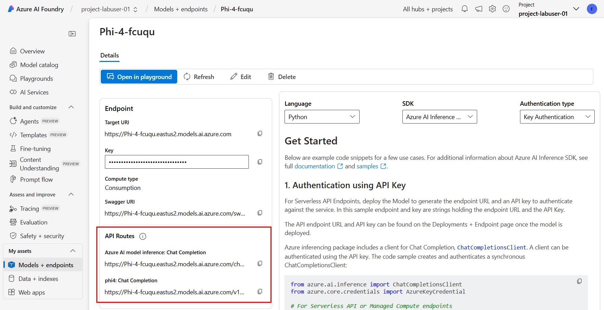
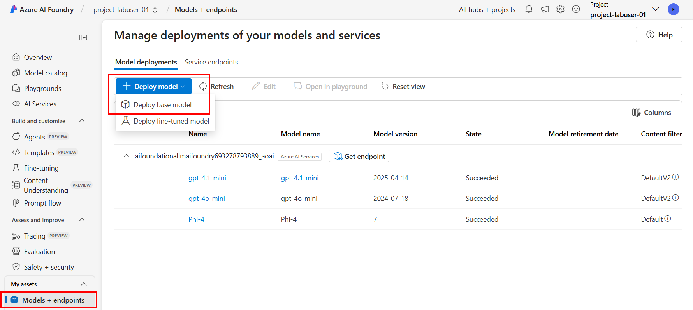

# Build Practical AI Solutions with Azure AI Foundry

This repository contains the materials for the **Build Practical AI Solutions with Azure AI Foundry** Workshop. The workshop is designed to help participants understand how to build practical AI solutions on top of [Azure AI Foundry](https://ai.azure.com/). The use case highlighted in the workshop is [FoundationaLLM](https://foundationallm.ai), a platform for deploying, scaling, securing and governing agents in the enterprise, built on top fo Azure AI Foundry.

## Workshop Agenda

1. **Agent Fundamentals** (presentation)
   - What is an agent?
   - The evolution of agents
   - When to build an agent?
2. **Azure AI Foundry** (presentation)
   - Introduction to Azure AI Foundry
   - Hubs and Projects
   - Azure AI Foundry SDK
   - Models
   - Azure AI Services
3. **Inference API** (presentation)
   - Overview of the Azure AI Model Inference API
4. **FoundationaLLM Overview** (presentation)
   - Agentic solution with FoundationaLLM
   - How we built FoundationaLLM on top of Azure AI Foundry
5. **Lab 1: A practical use of the Azure AI Model Inference API** (lab)
6. **Building Agents** (presentation)
   - Agent creation lifecycle
   - Azure AI Agent Service
   - Azure AI Foundry SDK for Agent Service
7. **Lab 2: Building agents with Azure AI Foundry** (lab)
8. **Building Agents - continued** (presentation)
   - Motivations for RAG
   - RAG as a tool
   - Azure AI Search
   - RAG and fine tuning
9.  **Demo 1: Knowledge Graphs - the future of RAG** (demo)
10. **Building Agents - continued** (presentation)
    - Code generation and execution as a tool
    - Analytics as a tool
11. **Demo 2: Going beyond the basic tools** (demo)
12. **Building Agents - continued** (presentation)
    - Logic apps as a tool
    - Agents as a tool
13. **Evaluating Agents**
    - Evaluations with Azure AI Foundry
    - Automated evaluation
    - Manual evaluation
    - Custom evaluators
14. **Responsible AI Tools & Practices**
    - Generative AI risks
    - Safguard with Trustworthy AI
    - Mitigation layers in Azure AI Foundry
15. **Use Cases and Open Q&A**


## Labs and Demos

### Lab 1: A practical use of the Azure AI Model Inference API

- **Objective**: Understand the Azure AI Model Inference API in Azure AI Foundry and how to leverage it in a solution.
- **Duration**: 30 minutes
- **Prerequisites**: Access to Azure AI Foundry.

### Exercise 1: A tour of the Azure AI Foundry Portal

In this exercise, you will tour the Azure AI Foundry Portal. You will be using your workshop account to access the portal.

>[!NOTE]
>Your workshop account should be `fllm-labuser-NN@foundationallm.ai` (where `NN` is your lab number assigned at the beginning of the workshop).

1. Login to the [Azure AI Foundry Portal](https://ai.azure.com/) using your workshop account.
   
2. Navigate to the `project-labuser-NN` project that is displayed at the top of the screen.

    

3. Select the **Overview** section from the left navigation pane and explore the service endpoints listed under **Included capabilities**.

    

4. Select the **Model catalog** section from the left navigation pane and explore the various models available within the project.

    

4. Select the **Playgrounds** section from the left navigation pane and explore the various playgrounds available within the project.

    

5. Select the **AI Services** section from the left navigation pane. Select the **Manage AI Services** button from the top right corner of the screen. Note the AI Services instance named `ai-foundationallmaifoundry693278793889` that is connected to the project. Select its name to view the details of the connection.

    

6. Select the **Models + endpoints** section from the left navigation pane and explore the various models and endpoints available within the project.

    

7. Spend a few more minutes exploring the rest of the sections in the left navigation pane.


### Exercise 2: Using the Azure AI Model Inference API

In this exercise, you will deply a model and interact with it using the Azure AI Model Inference API. You will be using your workshop account to access the portal.

1. Login to the [Azure AI Foundry Portal](https://ai.azure.com/) using your workshop account. 
2. Select the **Models + endpoints** section from the left navigation pane and select the `Phi-4` model deployment. Explore the endpoint details and note how the URL `https://ai-foundationallmaifoundry693278793889.services.ai.azure.com/models/chat/completions?api-version=2024-05-01-preview` is agnostic to the model being used. This is because the Azure AI Model Inference API is designed to be a generic API that can be used with any model deployed in Azure AI Foundry.

    

3. Explore the details on how to use the API with various programming languages. Note the code examples in various languages that demonstrate how to interact with the model using the Azure AI Model Inference API.

4. Select the **Open in playground** option to open the model in the playground. This will allow you to interact with the model and see how it responds to different questions.

5. We will now deploy a new model. Return to the **Models + endpoints** section and select the **Deploy base model** option from the **+ Deploy model** dropdown.

    

6. Enter the value `phi` in the search box, select the **Phi-4** model from the list of models, and select the **Confirm** button.

    

7. Select the **Agree and Proceed** button to accept the terms and conditions.

8.  Note the details of the deployment in the **Deploy model Phi-4** popup window. Select the **Connect and deploy** button to proceed with the deployment. After a short while, the deployment will fail with an error message stating that you do not have the required permissions to deploy the model. This is expected as the workshop account does not have the required permissions to deploy the model to the connected AI Services instance.

    

>[!NOTE]
>In real world scenarios, you will need to separate permissions between different teams from your organization, or even between members of the same team. To provide a simple example of how this works, your lab user was not granted the required permissions to deploy models at the hub level (this is intentional). The user's permissions are limited to the project level. Next, we will deploy the model at the project level.

9. By default, your project is configured to attempt to deploy models to the inference service of the AI Services instance that is connected to the project (the one that your user does not have permissions to deploy to). To change this, select the **Preview features** option from the top right corner of the screen and then make sure to turn off the **Deploy models to the Azure AI model inference service** option. This will allow you to deploy models to the project level.

    

10. Perform again the actions from steps 5 and 6. Note how the option has changed now. Select **Serverless API with Azure AI Content Safety** option to deploy the model. This option is available because the project is configured to deploy models to the project level.

    

10. Select the **Deploy** button to deploy the model.

11. View the deployment status of the model in the **Models + endpoints** section. The deployment may take a few minutes to complete. Note the code examples in various languages that demonstrate how to interact with the model using the Azure AI Model Inference API. Note the **API Routes** section and how this deployment option also provides an Azure AI model inference API endpoint (you should see a URL that is similar to `https://Phi-4-fcuqu.eastus2.models.ai.azure.com/chat/completions`).

    


### Exercise 3: Evaluate model performance

In this exercise, you will evaluate the performance of the model using the builtin capabilities for Azure AI Foundry. You will be using your workshop account to access the portal.

1. Select the **Evaluation** section from the left navigation pane and select the select the **+ New evaluation** button. Select the **Model and prompt** option.

    

2. Note the model that is selected for evaluation (`gpt-4.1-mini`). Navigate to the **Configure test data** section and enter the following text in the **Topic to generate questions about** field:

    ```txt
    The planets of our solar system.
    ```
    Select the **Generate** buton and note how the system generates a set of questions based on the topic.

    

3. Under the **Choose a model deployment as judge** section, select the `gpt-4o-mini` model deployment and then select the **Create** button.
    
    

4. Wait until the evaluation is completed. This may take a few minutes. Once the evaluation is completed, review the report.
   
   >[!NOTE]
   >The evaluation might take several minutes to complete. If the evaluation is still running after a few minutes, you can skip this step and come back to it later (e.g. at the beginning of the next lab).

You have now completed the lab. You have learned how to use the Azure AI Model Inference API to deploy and interact with models in Azure AI Foundry. You have also learned how to evaluate the performance of models using the builtin capabilities for Azure AI Foundry.
 
## Lab 2: Building agents with Azure AI Foundry

- **Objective**: Building agents atop Azure AI Foundry capabilities.
- **Duration**: 30 minutes
- **Prerequisites**: Access to Azure AI Foundry.

### Exercise 1: Create a new agent in the Azure AI Foundry portal

In this exercise, you will create a new agent in the Azure AI Foundry portal. You will be using your workshop account to access the portal.

1. Login to the [Azure AI Foundry Portal](https://ai.azure.com/) using your workshop account. Select the **Agents** section from the left navigation pane. If this is the first time you are accessing the portal, you will need to select an Azure Open AI Service resource. From the dropdown list select the `aifoundationallmaifoundry693278793889_aoai` option and the select the **Let's go** button. If you are not prompted to select an Azure Open AI Service resource, skip this step and select the **+ New agent** button.

    

2. A new agent has been created for you. Note the properties of the agent. Note how the `gpt-4o-mini` model deployment has been automatically selected for the agent, as this is the only Azure OpenAI model deployment that is compatible with the agent.

    

3. Under the **Instructions** section, enter the following instructions:

    ```txt
    You are a helpful assistant. Answer the questions to the best of your ability.
    ```

4. Select the **Try in playground** option to test the agent in the playground. This will allow you to interact with the agent and see how it responds to different questions.

    

5. Change the following agent settings to see how the agent responds after each change:
   - Instructions
   - Mode settings - Temperature
   - Mode settings - Top P

### Exercise 2: Add a code interpreter action to the agent

In this exercise, you will add a code interpreter action to the agent. The code interpreter action allows the agent to execute code and return the results.

1. Under the **Actions** section, select the **+ Add** option. 

    

2. Select the **Code interpreter** action from the list of actions.

    

3. Select the **Save** button to add the action to the agent.

    

4. Navigate to the playground and ask the agent the following question:

    ```txt
    Create Python code to calculate the first 10 Fibonacci numbers. Calculate the numbers and make the code available for download.
    ```

5. Note how the agent responds with the code and the download link. Download the code file and open it to validate the code.

### Exercise 3: Add a knowledge action to the agent

In this exercise, you will add a knowledge action to the agent. The knowledge action allows the agent to access external knowledge sources and use them to answer questions.

1. Under the **Knowledege** section, select the **+ Add** option. Select the **Files** options from the list of data sources.
   
    

2. Do not change the default options related to the vector store. Select the **Select local files** to upload files. 
   
    

3. Upload the [The Adventure of Whiskers](media/The_Adventure_of_Whiskers.pdf) file and select **Upload and save** to save the action.
   
    
    

4. Navigate to the playground and ask the agent the following question:

    ```txt
    Tell me about the adventure of Whiskers.
    ```

5. Note how the agent responds with the content.

### Exercise 4: Use a combination of knwoledge and code interpreter actions

In this exercise, you will use a combination of knowledge and code interpreter actions to create a PDF file that contains a summarized version of the adventure of Whiskers.

1. Ask the agent the following question:

    ```txt
    Create a PDF file that contains a summarized version of the adventure of Whiskers. Make the file available for download.
    ```
You have now completed the lab. You have learned how to create an agent in Azure AI Foundry and how to add actions to the agent. You have also explored how to use the agent in the playground and how to interact with it using different actions.


## Demo 1: Knowledge Graphs - the future of RAG
    
 - **Objective**: Understand the limitations of basic RAG, understand the potential of Knowledge Graphs and how can they be applied to improve RAG performance.
 - **Duration**: 30 minutes
 - **Prerequisites**: None

In this interactive demo we will explore how to use knowledge graphs to enhance the performance of RAG (Retrieval-Augmented Generation) agents. We will demonstrate the FoundationaLLM implementation of knowledge graphs and how they can be used to improve the performance of RAG agents.

## Demo 2: Going beyond the basic tools

  - **Objective**: Understand which are the benefits and the challenges of implementing a practical, enterprise-grade AI solution on top of Azure AI Foundry.
  - **Duration**: 30 minutes
  - **Prerequisites**: None

In this interactive demo we will explore how to use the FoundationaLLM platform to build agents that go beyond the basic tools. We will demonstrate how to use the FoundationaLLM platform to build agents that can perform complex tasks and how to use the FoundationaLLM platform to enrich the performance of agents with capabilities such as prompt rewriting, semantic caching, analytics, and more.